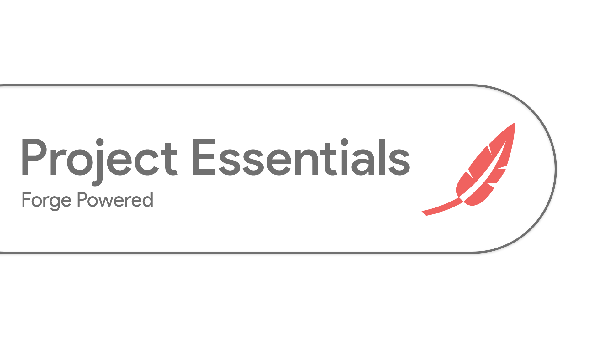

# 

## Minecraft command mod, adds useful commands in game and more for Forge

### Explore

#### [Download mod](https://github.com/ProjectEssentials/ProjectEssentials/releases/download/v1.14.4-1.0.1/Project.Essentials-1.14.4-1.0.1.jar) · [Commands](https://mairwunnx.gitbook.io/project-essentials/#commands-and-permissions) · [Configuration](https://mairwunnx.gitbook.io/project-essentials/#configuration) · [How to install](https://mairwunnx.gitbook.io/project-essentials/#how-to-install) · [Troubleshooting](https://github.com/ProjectEssentials/ProjectEssentials/issues/new/choose) · [CurseForge](https://www.curseforge.com/minecraft/mc-mods/ProjectEssentials) · [Change log](changelog.md)

### Dependencies

```none
    - mandatory (game will not start without a mod)
    - recommended (without a mod, game can start, but I recommend using it)
```

#### Mandatory

#### [Project Essentials Core](https://github.com/ProjectEssentials/ProjectEssentials-Core/releases) · [Project Essentials Permissions](https://github.com/ProjectEssentials/ProjectEssentials-Permissions/releases)

#### Recommended

#### [Project Essentials Cooldown](https://github.com/ProjectEssentials/ProjectEssentials-Cooldown/releases)

### Compatibility

This mod branch supported forge version `28.0.X` and `28.1.X` (Minecraft `1.14.4`).

### Credits

- Author: Pavel Erokhin [@mairwunnx](https://github.com/mairwunnx)
- [JetBrains](https://www.jetbrains.com/) for Licenses 🥰
- And you for contibuting and using it 😊🤗

[](https://ko-fi.com/mairwunnx)
